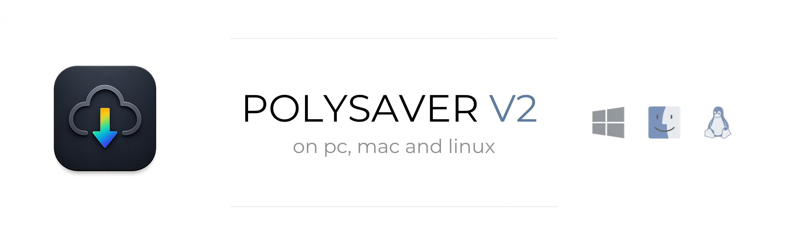

# PolySaver

**Pour le refus de payer ce qui devrait être gratuit**

Téléchargeur vidéo et audio  sans publicité ni abonnement et **rapide 🚀**.

[**⬇ Télécharger pour macOS (ARM64)**](https://github.com/AinsiParlaitZarathoustra/PolySaver/releases#release-PolySaver_V1.5_ARM64) · [**⬇ Télécharger pour Windows**](https://github.com/AinsiParlaitZarathoustra/PolySaver/releases#release-PolySaver_V1.5_Windows) · [**⬇ Télécharger pour Linux**](https://github.com/AinsiParlaitZarathoustra/PolySaver/releases#release-PolySaver_V1.5_Linux) · [**💬 Communauté Reddit**](https://www.reddit.com/r/PolySaver/)

---

## Pourquoi PolySaver

Les téléchargeurs vidéo du marché veulent vous vendre un abonnement pour des fonctions de base, affichent de la publicité, ou vous imposent des limites de téléchargement pour vous forcer à payer 💰. PolySaver fait la même chose en (beaucoup) mieux : une app de quelques mégaoctets, écrite en Rust ⚡️🔒, qui ne demande rien et ne renvoie rien et vous permet de télécharger sur votre ordinateur sans limite aucune les contenus de votre choix — sur PC, Mac et Linux.

## Fonctionnalités

### Deux façons de télécharger

**⚡ Téléchargement rapide** — Un clic. L'URL est analysée et le fichier téléchargé avec vos réglages par défaut.

**Téléchargement personnalisé** — Un panneau s'ouvre avec la miniature de la vidéo : choisissez le format, la qualité, le débit audio et la langue des sous-titres avant de lancer.

### Formats

| Vidéo | Audio |
|---|---|
| MP4 | MP3, FLAC |
| Sélection de la résolution | Débit configurable (128 / 192 / 320 kbps) |

### Sources

YouTube, Vimeo, X, TikTok, Instagram, Twitch, Dailymotion, Arte, France TV, Bandcamp — et plusieurs centaines d'autres plateformes.

### Le reste

- **Sous-titres** — récupérés automatiquement dans votre langue quand ils existent
- **Plusieurs téléchargements à la fois** — activable en un clic dans les réglages
- **Multiplateforme** — disponible sur PC, Mac et Linux

## Licence

PolySaver est distribué sous licence **GPL 3.0**. Voir le fichier [LICENSE](./LICENSE) pour le texte complet.
