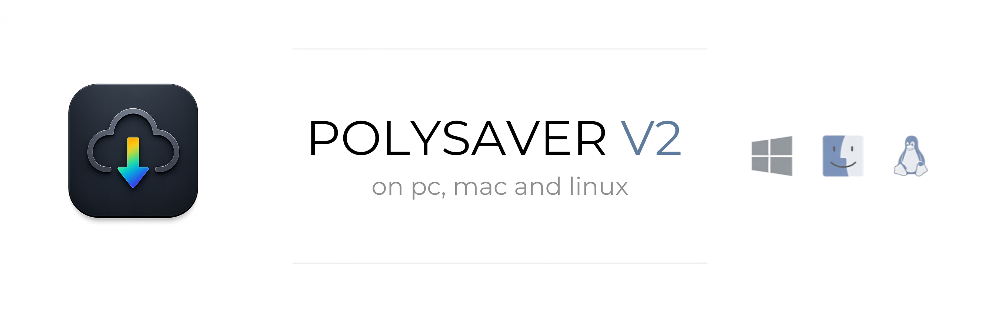

# PolySaver

**Pour le refus de payer ce qui devrait être gratuit**

Téléchargeur vidéo et audio sans publicité ni abonnement et **rapide 🚀**

[**⬇ Télécharger pour macOS (ARM64)**](https://github.com/AinsiParlaitZarathoustra/PolySaver/releases/download/v2.5.0/PolySaver_2.5.0_macOS_arm64.dmg) · [**⬇ Télécharger pour Windows**](https://github.com/AinsiParlaitZarathoustra/PolySaver/releases/download/v2.5.0/PolySaver_2.5.0_Windows_x64_Setup.exe) · [**⬇ Télécharger pour Linux**](https://github.com/AinsiParlaitZarathoustra/PolySaver/releases/download/v2.5.0/PolySaver_2.5.0_Linux_x64.deb) · [**💬 Communauté Reddit**](https://www.reddit.com/r/PolySaver/)

---

## 🆕 Version 2.5.0

La v2.5.0 est une grosse version qui a pris du temps, mais un temps nécessaire pour améliorer l'application.

- **Téléchargement de playlists** : possibilité de sélectionner et de télécharger les vidéos d'une playlist
- **Mise à jour de yt-dlp** : possibilité de mettre à jour directement yt-dlp depuis l'application
- **Contact par e-mail** : possibilité de me contacter directement depuis le menu « Aide et support »
- **Cookies du navigateur** : possibilité d'utiliser les cookies de votre navigateur pour télécharger les vidéos restreintes
- **Corrections de bugs** : résolution de différents problèmes visuels et fonctionnels
- **Interface et performances** : légères améliorations de l'interface et des performances

---

## Pourquoi PolySaver

Quand on veut télécharger une vidéo depuis internet, on a trois options :

- installer un « downloader » toujours payant, limité, bugué ou avec des pubs ;
- utiliser les sites de téléchargement YouTube, souvent douteux ;
- utiliser des outils complexes comme yt-dlp.

Moi, ça ne me va pas. J'ai donc créé un logiciel qui répond à mon besoin : de la puissance, mais surtout de la simplicité. La puissance de yt-dlp dans une interface très simple que n'importe qui peut comprendre. Une application sans bugs, sans pubs, sans limites et gratuite.

J'aurais adoré trouver ça il y a cinq ans. Si vous avez le même besoin que moi, téléchargez PolySaver.

## Fonctionnalités

### Deux façons de télécharger

#### ⚡️ Téléchargement rapide

Collez l'URL de la vidéo, appuyez sur le bouton vert et PolySaver s'occupe du reste. Ce mode ne fonctionne pas avec les playlists.

#### ⚙️ Téléchargement personnalisé

Collez l'URL de la vidéo : une fenêtre s'ouvre. Choisissez le format et la qualité, sélectionnez les vidéos à télécharger s'il s'agit d'une playlist, et voilà.

### Formats supportés

| Type | Formats | Options |
| --- | --- | --- |
| Vidéo | MP4 et MOV | Sélection de la résolution |
| Audio | MP3 et FLAC | Sélection du débit (MP3) |

> 💡 Depuis la version 2.0.0, PolySaver intègre un guide des formats dans le menu « Aide et support » pour vous expliquer à quoi correspond chaque format et lequel est le plus adapté à vos besoins.

### Sites supportés

yt-dlp prend en charge plus de 1 700 sites, dont YouTube, X, Facebook, Instagram, OK.ru, Dailymotion et Twitch.

## Composants utilisés dans PolySaver

Le code source étant public, vous pouvez regarder vous-même ce qui se trouve à l'intérieur de PolySaver. Voici un bref aperçu des principaux composants :

- **Tauri + React + MUI** pour l'interface : le meilleur choix pour la simplicité utilisateur
- **yt-dlp** : moteur de téléchargement
- **FFmpeg** : moteur de conversion — c'est grâce à lui que vous pouvez choisir le format
- Runtime JavaScript : désormais obligatoire pour télécharger correctement les vidéos YouTube. Ne pas l'installer peut rendre le téléchargement des vidéos impossible ou incomplet.

## Le reste

- **Plusieurs téléchargements à la fois** : pour aller plus vite
- **Multiplateforme** : prend en charge macOS, Windows et Linux depuis la version 2.0.0
- **Sous-titres** : bientôt disponibles

## Licence

PolySaver est, comme yt-dlp qu'il intègre, distribué sous licence GPL 3.0. Consultez le fichier [LICENSE](./LICENSE) pour lire le texte complet.

Je réfléchis toujours à modifier le rôle de yt-dlp dans PolySaver afin de permettre une distribution sous licence Apache 2.0, que je juge plus adaptée à ma vision du produit et plus raisonnable.
